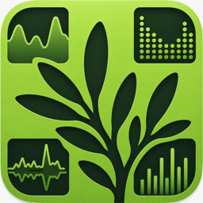
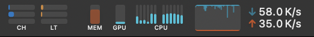

# MenYew

**A lightweight macOS menu-bar monitor for live system stats and AI usage.**

Network · CPU · GPU · Memory · Claude &amp; Codex usage — all in the menu bar.

### [⬇︎ Download the latest release](https://github.com/ConceptHouse/menyew-releases/releases/latest)

*Universal build — Apple silicon &amp; Intel · macOS 13 (Ventura) or later · signed &amp; notarized by Apple*

---

## What it is

MenYew puts a set of compact, always-visible monitors in your macOS menu bar. Each one is a tiny live graph or meter you can click for a detailed popover, and every monitor can be styled, relabeled, or packed tightly next to the others. It stays out of your way: no Dock icon by default, no window — just the stats you care about, glanceable at the top of the screen.

## Features

### System monitors
- **Network** — per-interface upload/download graphs, WAN &amp; LAN IP addresses, Tailscale status, and a "top apps" breakdown of what's using the connection. Pick interfaces individually or show them all.
- **CPU** — overall sparkline and/or a per-core bar meter, with the performance/efficiency-core split on Apple silicon (efficiency cores can use their own color).
- **GPU** — accurate utilization (time-residency based, on Apple silicon) as a single bar.
- **Memory** — usage at a glance, with a detail popover.
- **Combined** — pack several monitors into a single menu-bar slot with custom spacing, so they sit tightly together instead of spread across the bar.

### AI usage
- **Claude** and **Codex** — per-account session / weekly / credit-limit meters and token totals, read from your local CLI logs. Multiple accounts, each with its own color.

### Appearance &amp; settings
- Global colors, monochrome mode, and refresh interval, with **per-module overrides**.
- Optional text labels on any monitor.
- A clean, grouped settings window.
- **Export / import** all your settings to a file.

### Built for macOS
- **Universal binary** — runs natively on both Apple silicon and Intel Macs.
- **Automatic updates** built in (powered by [Sparkle](https://sparkle-project.org)) — toggle it under Settings → General, or check manually any time.
- **Signed with an Apple Developer ID and notarized by Apple**, so it opens with no security warnings.

## Install

1. **[Download the latest `menyew-x.y.z.zip`](https://github.com/ConceptHouse/menyew-releases/releases/latest)**.
2. Unzip it and drag **`MenYew.app`** into your **Applications** folder.
3. Open it. MenYew lives in the menu bar — a Dock icon is shown on first launch so you can find it, and you can hide it afterward in **Settings → General**.

After the first install, MenYew keeps itself up to date automatically.

## Requirements

- macOS 13 (Ventura) or later
- Apple silicon or Intel

## Updates

This repository hosts the public update channel for MenYew:

- **[Releases](https://github.com/ConceptHouse/menyew-releases/releases)** — every notarized build, with notes.
- **`appcast.xml`** — the Sparkle feed the app polls for automatic updates.

## Privacy

MenYew runs entirely on your Mac. AI-usage figures are read from your local CLI logs, and any account sign-in credentials are stored locally and are never included in exported settings. There is no analytics or telemetry.
